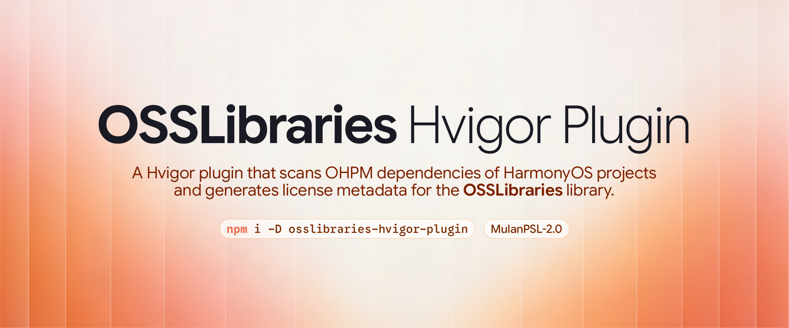

# OSSLibraries Hvigor Plugin

一个 Hvigor 插件，用于扫描 HarmonyOS 项目的 OHPM 依赖项，并为 [OSSLibraries](https://github.com/composable-tu/osslibraries) 库生成许可证元数据。



[English](README.md)

## 特性

- **开箱即用** — 注册一次插件，每次构建自动从 `oh_modules/` 重新生成 License 列表，输出始终与实际发布的依赖保持一致。
- **构建期集成** — 作为 Hvigor 任务运行，将 `osslibraries.json` 写入 entry 模块的 `rawfile/` 目录，随 HAP 打包，运行时即可读取。
- **精准 License 识别** — 完整解析 `Apache-2.0 OR MIT` 等 SPDX 表达式，自动纠正拼写错误，表达式中的每个许可证均被列出。
- **完整 License 文本** — 优先读取包内自带的 `LICENSE` 文件，缺失时自动回退到 SPDX 规范文本。
- **多版本依赖处理** — 同一依赖安装了多个版本，每个版本独立列出，并各自携带对应的 License。

## 使用

使用 npm 安装：

```zsh
npm install osslibraries-hvigor-plugin --save-dev
```

也可以使用 Yarn、pnpm、Vite+、vlt、Bun 等包管理器/构建工具安装：

```zsh
yarn add osslibraries-hvigor-plugin --dev
pnpm add osslibraries-hvigor-plugin -D
vp add osslibraries-hvigor-plugin -D
vlt install osslibraries-hvigor-plugin -D
bun add osslibraries-hvigor-plugin -D
```

然后编辑 `entry/hvigorfile.ts` 以注册插件（也可以自定义载入哪个模块，这里仅以 `entry` 举例）:

```TS
import { hapTasks } from '@ohos/hvigor-ohos-plugin';
import { ossScanPlugin } from 'osslibraries-hvigor-plugin';

export default {
  system: hapTasks,
  plugins: [ossScanPlugin()]
}
```

> [!TIP]
> 如果项目中有不想出现在 License 列表中的模块，可将依赖名传入 `selfModules`（注册插件的模块总是自动排除）:
>
> ```ts
> plugins: [ossScanPlugin({ selfModules: ["mylibrary", "3rdlibrary"] })];
> ```

## 配置

### `format`

生成许可证元数据的输出格式（默认 `"json"`）。

| 值               | 输出文件               | 说明                     |
| ---------------- | ---------------------- | ------------------------ |
| `"json"`         | `osslibraries.json`    | 人类可读 JSON（默认）。  |
| `"message-pack"` | `osslibraries.msgpack` | 紧凑二进制 MessagePack。 |

```ts
plugins: [ossScanPlugin({ format: "message-pack" })];
```

输出文件扩展名随 `format` 而定，除非显式设置 `outputFile`。

每次构建时，插件会扫描 `oh_modules/` 并生成 `entry/src/main/resources/rawfile/osslibraries.<ext>`（默认 `osslibraries.json`）。
